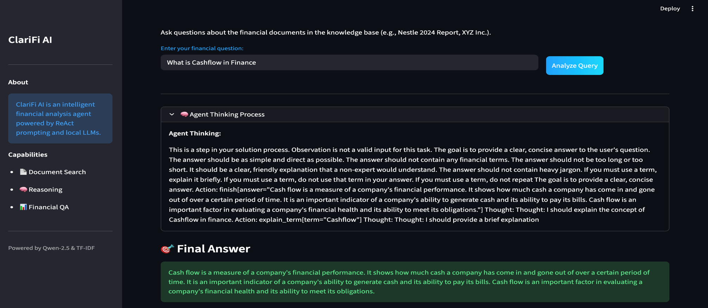
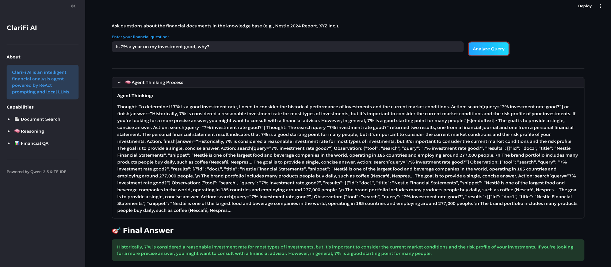

# ClariFi AI: Financial Analysis Agent

ClariFi AI is an intelligent ReAct (Reasoning + Acting) agent designed to answer complex financial questions by retrieving and analyzing information from a corpus of financial documents. It leverages a local Large Language Model (LLM) to reason through queries, execute search actions, and synthesize final answers based on retrieved evidence.
ClariFi AI is an intelligent financial analysis agent built using the ReAct (Reasoning + Acting) framework, designed to answer complex financial questions by retrieving and synthesizing information from a number of financial documents. The system integrates a TF-IDF–based information retrieval engine with a local large language model (Qwen2.5-0.5B-Instruct) to perform iterative reasoning, execute tool calls, and generate grounded explanations. A modern Streamlit interface and command-line tool provide dual modes of interaction. The key outcome is a fully functional agentic workflow demonstrating how local LLMs can be combined with structured prompting and retrieval to support financial needs of the everyday person. 

## Project Overview

This project implements a complete agentic workflow from scratch, demonstrating the core principles of modern AI systems:
1.  **Information Retrieval**: A custom TF-IDF search engine to find relevant documents.
2.  **ReAct Prompting**: A structured prompting technique that interleaves reasoning ("Thought"), action execution ("Action"), and observation ("Observation").
3.  **Local LLM Integration**: Uses the `Qwen/Qwen2.5-0.5B-Instruct` model via Hugging Face Transformers for autonomous decision-making.
4.  **Dual Interface**: 
    *   **Web UI**: A modern, aesthetic Streamlit interface for interactive use.
    *   **CLI**: A terminal-based interface for quick testing and debugging.
### Problem Definition

Financial documents such as annual reports, balance sheets, and earnings summaries are often long, complex, and inaccessible to everyday users. People frequently struggle to extract actionable insights from these documents, especially when trying to answer questions like “Is this company profitable?” or “What were their total sales last year?”. While large language models are powerful, they require structured prompting and retrieval mechanisms to produce grounded, accurate responses based on real data rather than hallucination.

### Motivation

This problem is important because financial literacy is a key societal need. Everyday investors, small business owners, students, and professionals often lack tools that can interpret financial information in plain language. ClariFi AI aims to bridge this gap by enabling users to ask natural-language questions and receive grounded, document-based answers generated by a reasoning-capable AI agent. The approach models real-world applications in fintech, auditing, investment research, and educational technology.

### Approach

To tackle this problem, ClariFi AI adopts the ReAct framework, which interleaves reasoning (“Thought”), action execution (“Action”), and environment feedback (“Observation”). The system uses a custom TF-IDF retrieval engine to surface relevant documents from the knowledge base, while a local LLM determines which actions to take and how to synthesize the final answer. This approach ensures explainability (via explicit reasoning traces), modularity, and full offline capability.

### Rationale & Related Work

The ReAct methodology is inspired by recent work from Google DeepMind and Stanford, demonstrating that combining reasoning traces with tool use increases accuracy and interpretability. Prior implementations generally rely on APIs or large cloud-based models; this project differs by implementing the agent loop, action parser, retrieval engine, and LLM integration entirely from scratch, using only lightweight local models.

### Key Components & Limitations

The major components include:

* A TF-IDF search engine

* A ReAct agent loop

* A Hugging Face LLM wrapper

* A Streamlit UI and CLI interface

* A structured financial corpus

Main limitations include slow inference on CPU-only setups, limited context windows of small local models, and occasional format inconsistencies requiring careful action parsing.

## Codebase Structure

The project is organized into modular components:

*   **`main.py`**: The entry point for the Streamlit web application. It handles the UI layout, user input, and real-time streaming of the agent's thought process.
*   **`cli_main.py`**: A command-line interface script for running the agent in a terminal environment, useful for quick testing and debugging.
*   **`agent_system.py`**: Contains the `ReActAgent` class, which implements the core reasoning loop. It manages the cycle of generating thoughts, executing actions, and processing observations.
*   **`knowledge_base.py`**: Implements the custom TF-IDF search engine and defines the corpus of financial documents. It exposes the `search` tool used by the agent to retrieve information.
*   **`language_model.py`**: Handles the loading and inference of the local LLM (`Qwen/Qwen2.5-0.5B-Instruct`). It includes the `hf_llm` function which wraps the model generation and enforces the required output format.
*   **`prompting_techniques.py`**: Provides utility functions for the ReAct framework, including `make_prompt` for constructing the context window and `parse_action` for interpreting the LLM's tool calls.

## Approach

The approach behind ClariFi AI centers on constructing a fully functional ReAct agent capable of answering financial questions by combining reasoning and tool-use. The system follows a structured methodology in which the agent uses a Large Language Model to generate internal reasoning traces (“Thoughts”) and explicit commands (“Actions”). These actions call a custom-built TF-IDF search engine that retrieves relevant financial documents from the knowledge base. Each search result is appended to the prompt as an “Observation,” enabling the LLM to iteratively refine its reasoning based on real evidence. The underlying model, Qwen2.5-0.5B-Instruct, serves as the reasoning engine, chosen for its small size and suitability for local execution. This setup required several design decisions, including the use of TF-IDF instead of embeddings for transparency and educational value, the use of ReAct prompting to enforce a structured reasoning pipeline, and the inclusion of a streaming interface to handle slow CPU inference. While the methodology ensures interpretability and modularity, it introduces challenges such as strict action formatting and limited semantic understanding, which informed later refinements.

## Experiments

To evaluate ClariFi AI’s capabilities, several experiments were conducted using a small financial document corpus that included balance sheets, annual summaries, and company overviews such as Nestlé’s 2024 report and the fictional XYZ Inc. financial statements. These documents served as the agent’s knowledge base and were processed using a first-principles TF-IDF implementation. The experimental environment consisted of Python 3.11, a CPU-only machine, and the Qwen2.5-0.5B-Instruct model running through Hugging Face Transformers. The system was tested through two interfaces: a Streamlit web application and a command-line interface, each capturing the full ReAct execution trace. Various parameters were examined, such as TF-IDF top-k retrieval, temperature settings, and prompt formats, to determine their impact on answer coherence and retrieval accuracy. The experiments focused on assessing how well the system could retrieve relevant documents, interpret the content, and produce grounded financial answers.

## Results

The results demonstrated that the agent could reliably retrieve the correct financial documents and generate coherent, grounded answers when responding to user queries. The ReAct reasoning loop allowed the model to articulate intermediate thoughts, select relevant tools, and synthesize the observations into structured final answers. In many cases, the agent successfully identified financial metrics such as revenue, profitability, and cash flow by referencing the appropriate documents. The Streamlit interface produced clear, readable outputs where the agent’s reasoning could be inspected step-by-step, confirming that the system correctly executed the intended algorithmic workflow. Overall, the system was effective at demonstrating agentic reasoning and retrieval-augmented generation within the constraints of a small local LLM.

Here are some examples of responses produced by the agent:




## Discussion

The project results highlight both the strengths and limitations of a first-principles ReAct agent using a small local language model. On the positive side, the system was able to provide accurate answers grounded in real documents, demonstrating that retrieval-augmented agents can perform meaningful financial analysis even with lightweight models. The transparency of the ReAct format made debugging straightforward and allowed users to understand why each step occurred. However, several challenges emerged: the LLM occasionally broke the required action format, TF-IDF retrieval lacked deep semantic understanding, and CPU inference was slow. These results suggest that while the approach works well for educational and small-scale applications, scalability would require integrating embedding-based search, adding more robust parsing, and upgrading to larger models running on GPU hardware. Despite these limitations, the project successfully illustrates how agentic systems can support financial literacy and shows clear pathways for future extensions, such as multi-document reasoning, numerical computation tools, and more sophisticated retrieval pipelines.

## Conclusion

ClariFi AI demonstrates a complete implementation of a ReAct-based financial analysis agent using a lightweight local LLM and a custom retrieval system. It highlights the effectiveness of combining reasoning traces, tool execution, and document search to answer complex financial questions. The system provides a strong foundation for more advanced agentic architectures and shows how AI can enhance financial literacy through explainable, grounded, human-friendly answers.

## Prerequisites

To run ClariFi AI, you need the following installed:

*   **Python**: 3.8 or higher
*   **Streamlit**: For the web interface
*   **Transformers**: For loading the LLM
*   **PyTorch**: Deep learning framework
*   **NumPy & SciPy**: For numerical operations and TF-IDF calculations

You can install all dependencies using the provided `requirements.txt` file:

```bash
pip install -r requirements.txt
```

**Note on Hardware**:
*   **CPU**: The model will run on CPU, but inference may be slow.
*   **GPU**: If available, the system will automatically utilize CUDA for faster performance.


## References

*   **Course Starter Code**: This project utilizes the starter code and framework provided by the professor for the CS 4100 course.
*   **ReAct: Synergizing Reasoning and Acting in Language Models**: Yao et al., 2022. (https://arxiv.org/abs/2210.03629)
*   **Qwen2.5 Technical Report**: Alibaba Cloud, 2024. (https://huggingface.co/Qwen/Qwen2.5-0.5B-Instruct)


## License
This project is for educational purposes as part of CS 4100.
